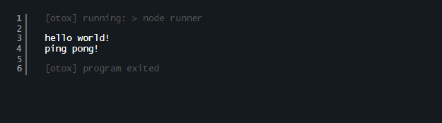

# Otox.js

🛠️ code runner with web browser

## Installation

you can install it with npm:

```bash
$ npm install @otox/cli -g
```

```bash
$ otox <command> --port=<port>
```

## Example

[example file](./runner.js)

```js
// runner.js

console.log("hello world!");
console.log("ping pong!");
```

```bash
$ otox node runner.js --port=8080
```

see the result: [localhost:8080](http://localhost:8080)


